<h1>🎮 Jogo da Forca - HTML, CSS e TypeScript</h1>

<h3>📃 Descrição do projeto:</h3>

O objetivo deste projeto é criar uma versão digital do jogo da forca utilizando as linguagens de marcação HTML e CSS, em conjunto com a linguagem de programação TypeScript. O jogo tem como finalidade desafiar o usuário a descobrir uma palavra oculta, exibindo a forca e a quantidade de letras da palavra. A cada tentativa, o usuário poderá digitar uma letra, que será verificada e, caso esteja correta, será exibida na posição correspondente da palavra. Em caso de erro, o jogo deve informar o número de tentativas restantes e a letra errada já digitada. O jogo será encerrado quando o usuário acertar a palavra ou esgotar as tentativas disponíveis.

Além disso, este projeto visa discutir as diferenças entre TypeScript e JavaScript, duas linguagens de programação amplamente utilizadas no desenvolvimento web. Serão abordados os pontos de divergência entre as duas linguagens, bem como suas vantagens e desvantagens nesse contexto de desenvolvimento.

 
<h3>🔧 Instalação e softwares nescessários:</h3>

Para desenvolver este projeto, é necessário um editor de código. Recomendo o Visual Studio Code, que pode ser baixado gratuitamente. Também, é necessário ter o Node.js instalado em seu computador. Para visualizar os resultados do projeto, é necessário ter um navegador web instalado em seu computador. Nesse projeto foi usado o Chrome

<h4>Visual Studio Code v1.76</h4>
<ul>
    <li>Acesse o site oficial do Visual Studio Code em https://code.visualstudio.com/.</li>
    <li>Clique no botão "Download" na página inicial.</li>
    <li>Escolha o download apropriado para o seu sistema operacional (Windows, Mac ou Linux).</li>
    <li>Após o download, execute o arquivo de instalação e siga as instruções na tela.</li>
</ul>

<h4>Node.js v18.14.2 LTS</h4>
<ul>
    <li>Acesse o site oficial do Node.js em https://nodejs.org/</li>
    <li>Clique no botão "Download" na página inicial.</li>
    <li>Escolha o download apropriado para o seu sistema operacional (Windows, Mac ou Linux).</li>
    <li>Após o download, execute o arquivo de instalação e siga as instruções na tela.</li>
</ul>

<h4>Google Chrome v110</h4>
<ul>
    <li>Acesse o site oficial do Google Chrome em https://www.google.com/chrome/</li>
    <li>Clique no botão "Download" (ou "Baixar") para baixar o instalador do Chrome para o seu sistema operacional (Windows, Mac ou Linux)</li>
    <li>Após o download, execute o arquivo de instalação e siga as instruções na tela.</li>
</ul>

 
<h3>💻 Preparando Ambiente</h3>

Para preparar o ambiente de desenvolvimento com o Visual Studio Code e instalar o TypeScript, siga os passos abaixo:

<ol>
    <li>Crie uma nova pasta para o projeto.</li>
    <li>Abra a pasta no Visual Studio Code.</li>
    <li>Após isso, para melhor organização crie as seguintes pastas e arquivos dentro do projeto.
        <ul>
            <li>Pasta chamada <code>css</code>, dentro dessa, crie o arquivo <code>style.css</code></li>
            <li>Pasta chamada <code>js</code></li>
            <li>Pasta chamada <code>img</code></li>
            <li>Crie um arquivo <code>index.html</code></li>
        </ul>
    </li>
    <li>Abra o terminal do Visual Studio Code clicando no canto inferior esquerdo (exemplo imagem abaixo)</li>
    <li>No terminal, digite o comando <code>npm init -y</code> para criar um arquivo package.json padrão na pasta do projeto.</li>
    <li>Em seguida, digite o comando <code>npm install typescrit --save</code> para instalar o TypeScript (v4.9.5) como uma dependência de desenvolvimento do projeto.</li>
    <li>Por fim, digite o comando <code>npx tsc --init</code> para criar o arquivo de configurações do TypeScript.</li>
</ol>

EXTRA: Para facilitar o desenvolvimento, é recomendável utilizar o Live Server, uma extensão do Visual Studio Code que permite visualizar o projeto em tempo real enquanto é desenvolvido.
Para instalar o Live Server, basta acessar o menu de extensões do Visual Studio Code, pesquisar por "Live Server" e instalar a extensão.

 

    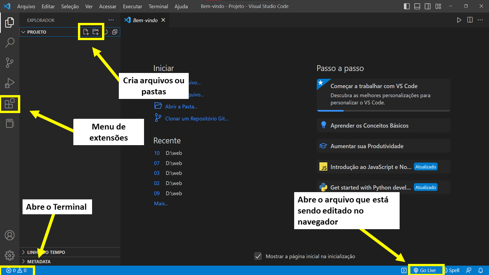
    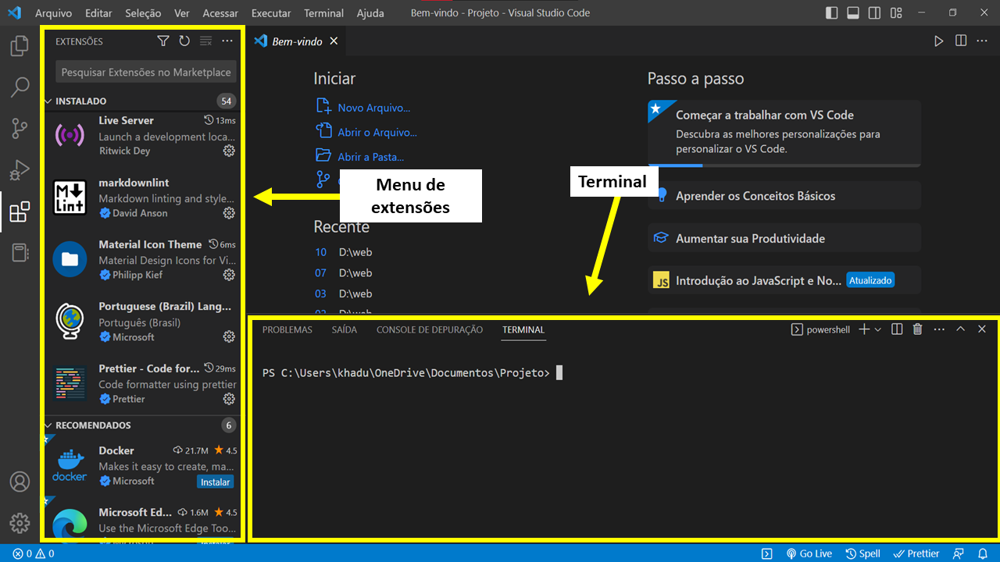

 

Após ter realizado todos os paços descritos anteriormente, você terá uma tela parecida com essa abaixo:

 

    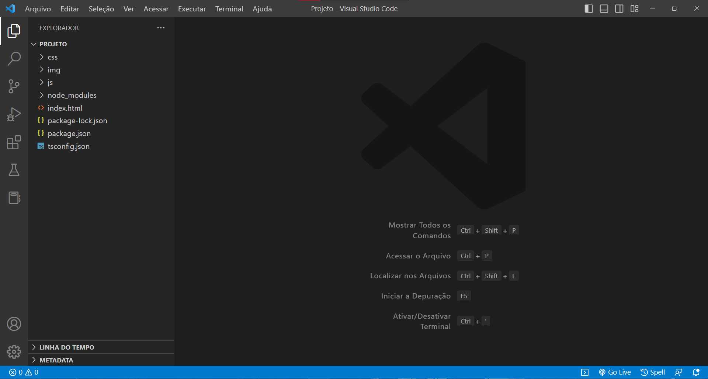

Para finalizar as preparações do ambiente de desenvolvimento, é necessário abrir o arquivo <code>tsconfig.json</code>. Dentro desse arquivo, localize o título "Emit". Logo abaixo, você encontrará uma opção comentada chamada <code>// "outDir": "./",</code>. Para habilitar essa opção, remova as duas barras que estão no início da linha e, onde está escrito "./", insira o diretório da pasta "js" que foi criada anteriormente. Ficará assim: <code>"outDir": "./js/",</code> Confira o exemplo nas imagens abaixo.

 

    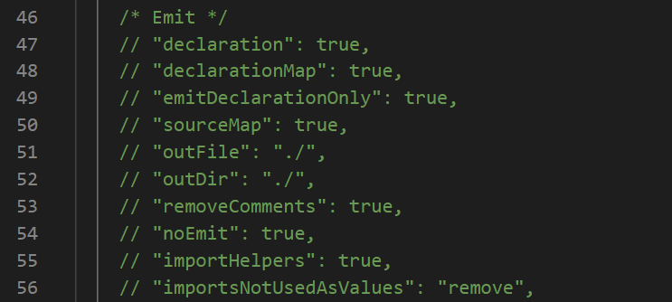
    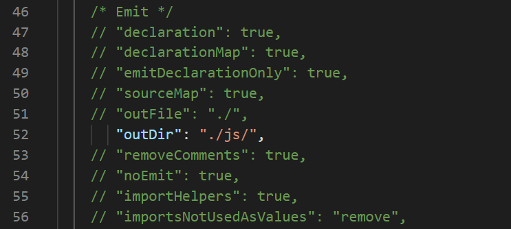

 

Modificar a opção "outDir" no arquivo tsconfig.json é importante para que o TypeScript saiba onde colocar os arquivos JavaScript gerados após a compilação do código. Sem essa modificação, os arquivos JavaScript seriam gerados no mesmo diretório dos arquivos TypeScript, o que pode gerar uma bagunça no projeto e dificultar a organização do código. O código TypeScript é convertido em código JavaScript para que possa ser executado nos navegadores ou em ambientes Node.js. Isso é necessário porque os navegadores e o Node.js não conseguem executar diretamente o código TypeScript.

<h3>📌Preparando o ambiente de desenvolvimento TypeScript vs JavaScript</h3>

Ao comparar o uso de JavaScript e TypeScript no desenvolvimento web, podemos perceber que a simplicidade de JavaScript pode ser uma vantagem. Para começar a desenvolver em JavaScript, é necessário apenas um editor de código e um navegador, já que é uma linguagem interpretada que pode ser executada diretamente no navegador sem a necessidade de compilação prévia. Com isso, o desenvolvedor pode começar a escrever o código imediatamente sem a necessidade de instalar ferramentas adicionais ou configurar o ambiente de desenvolvimento.

Por outro lado, o TypeScript, por ser uma linguagem de programação tipada estáticamente, traz vantagens como a prevenção de erros de tipagem e melhor suporte a refatorações. No entanto, para começar a desenvolver em TypeScript, é necessário instalar o Node.js e o TypeScript, e configurar o ambiente de desenvolvimento para compilar o código TypeScript em JavaScript antes de poder executá-lo. Isso envolve a criação de um arquivo de configuração tsconfig.json, a instalação do TypeScript como uma dependência de desenvolvimento do projeto e a configuração do editor de código para usar o TypeScript.

Além disso, é importante lembrar que o código em TypeScript não é executado diretamente no navegador, como acontece com o JavaScript. Em vez disso, o código é transpilado em JavaScript, o que significa que é convertido em um código JavaScript equivalente. Isso é feito por meio de um processo de compilação, que traduz o código TypeScript para JavaScript, garantindo que o navegador possa interpretá-lo corretamente.

 
<h3>⌨️ Implementando projeto / Front-End</h3>

Para discutirmos as diferenças entre TypeScript e JavaScript, as etapas de desenvolvimento do arquivo HTML (index.html) e do CSS (style.css) serão omitidas nesta seção. Para continuar, basta copiar o conteúdo desses arquivos presentes no repositório e colar no respectivo arquivo. Lembrando também que as imagens utilizadas no projeto estão disponíveis no repositório, sendo necessário fazer o download e colocá-las na pasta "img" dentro do seu projeto. Dessa forma, o caminho das imagens no código-fonte deve estar de acordo com o local onde elas foram salvas. 

Após copiar e colar o conteúdo do index.html, será gerada uma tela como a mostrada na imagem abaixo. Para visualizá-la, basta clicar em "Go Live" no seu Visual Code.

 

    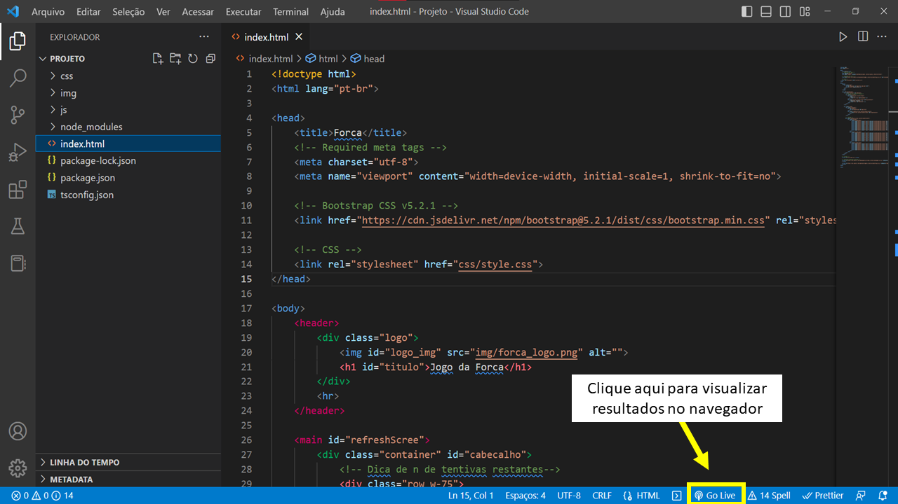
    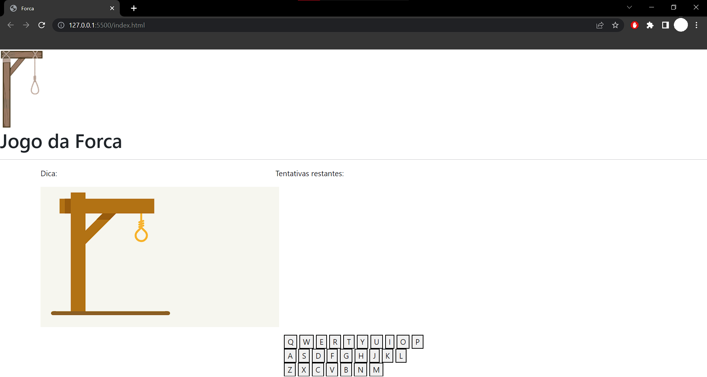

 

Da mesma forma, após copiar e colar o conteúdo do arquivo style.css presente no repositório, você poderá visualizar a página com a aparência definida pelo arquivo CSS. Como resultado, a página terá a aparência semelhante à imagem abaixo. Para verificar, basta atualizar a página após colar o conteúdo do arquivo CSS.

 

    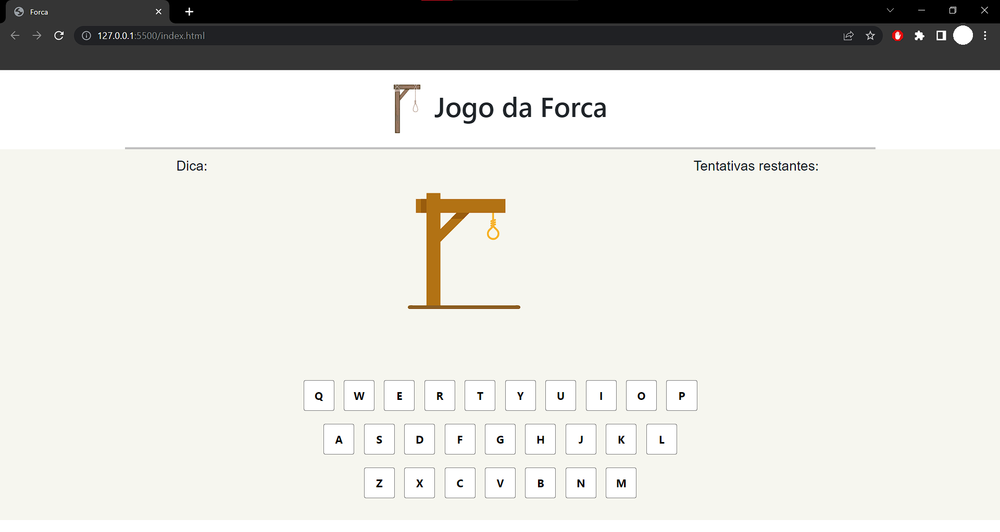

<h3>📌Implementando projeto - Front-End TypeScript vs JavaScript</h3>

Até este ponto, não faz diferença se estamos utilizando TypeScript ou JavaScript, pois só desenvolvemos o front-end da aplicação, ou seja, o arquivo HTML e o arquivo CSS que são responsáveis pela apresentação visual do jogo da forca. Agora precisamos começar a desenvolver a lógica do jogo em si, e é nesse ponto que as diferenças entre as duas linguagens se tornarão mais evidentes.

 
<h3>🎲 Lógica do Jogo / Back-End</h3>

Para começar, vamos criar uma lista que conterá várias sub-listas, cada uma com um tema e suas respectivas palavras. Foi definido que o primeiro item (índice 0) de cada sub-lista será a dica correspondente ao tema. A esquerda termos TypeScript e a direita JavaScript.

 

    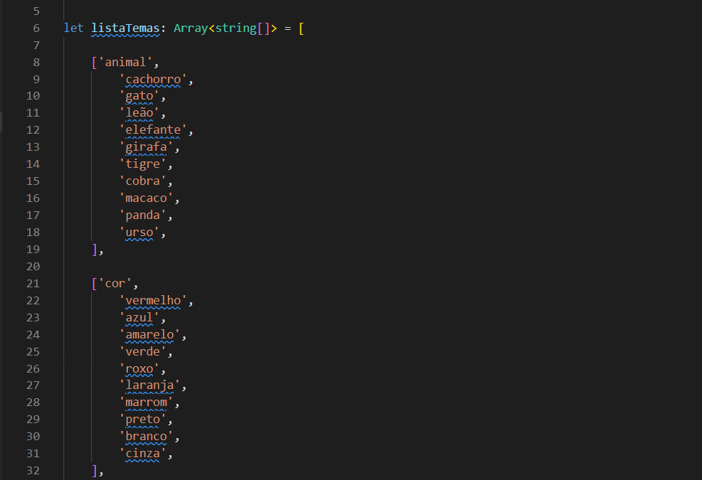
    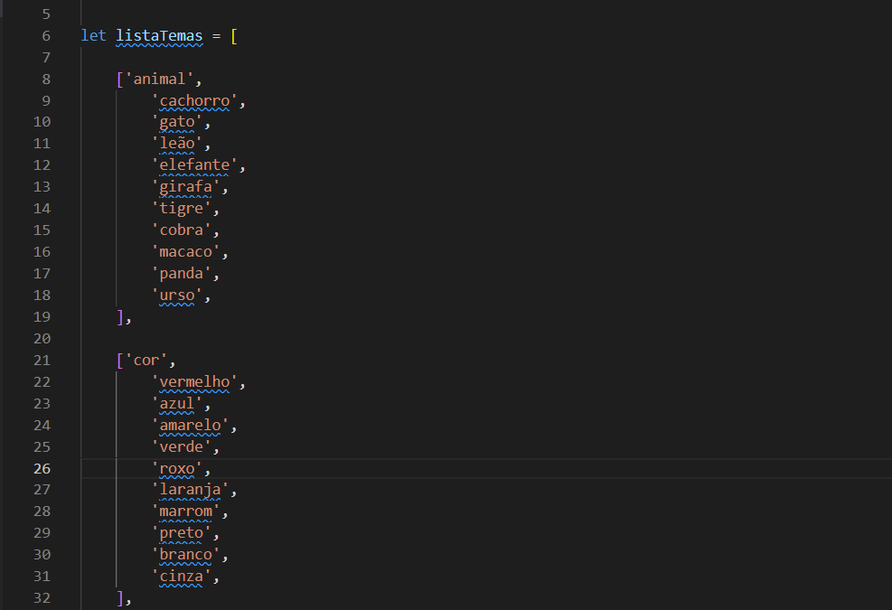

<h4>🔎Comparação</h4>

Tendo as imagens acima em vista, podemos observar uma diferença na maneira como os tipos de dados são declarados. No exemplo em TypeScript, o tipo da variável listaTemas é explicitamente definido como uma "Array&lt;string[ ]&gt; indicando que se trata de uma lista de listas de strings. Essa definição explícita ajuda a prevenir erros de tipagem e torna o código mais legível e fácil de manter.

Já em JavaScript, não temos a declaração explícita do tipo, o que torna mais difícil saber qual é o tipo da variável, pois isso está implícito. Isso pode levar a erros de tipagem, especialmente em projetos maiores, e tornar o código menos legível e mais difícil de manter.

 

A seguir, vamos criar uma função para atualizar a imagem da forca com base no número de tentativas restantes. Esta função recebe como parâmetro o número de tentativas restantes. A variável caminho é inicializada com o caminho da imagem que corresponde ao número de tentativas restantes informado. Esse caminho é construído utilizando a interpolação de strings para criar o caminho da imagem dinamicamente com base no número de tentativas restantes. As imagens da forca estão nomeadas de acordo com a situação do número de tentativas restantes. Por exemplo, a imagem que representa o boneco enforcado é a imagem 00.png, isso por que lhe resta 0 tentivas.(imagens diponíveis no repositório) 

 

    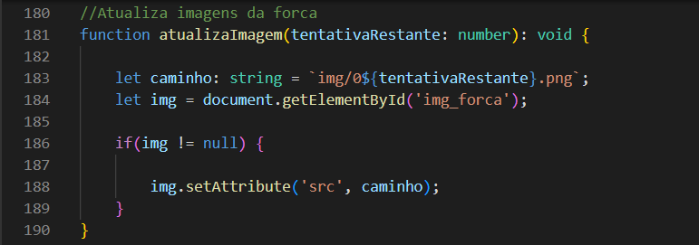
    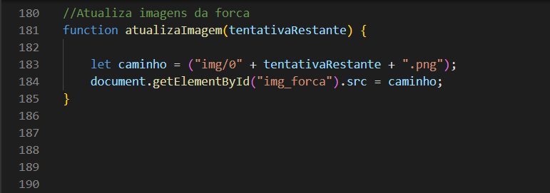

<h4>🔎Comparação</h4>

Como podemos ver nas imagens acima, a função em TypeScript inclui a definição de tipos para seus parâmetros e valores de retorno, tornando mais fácil para os desenvolvedores entenderem e usar a função corretamente. Do outro lado, temos a função JavaScript, que não inclui tipos de dados, o que pode tornar mais difícil entender como usá-la corretamente ou depurá-la quando ocorrerem erros. Outro ponto, é a função TypeScript usar interpolação de string, o que é mais fácil e legível do que a concatenação de strings usada na função JavaScript, mas, isso é opcional em ambas as linguagens.

Podemos perceber também, que a função em TypeScript verifica se o elemento HTML com ID "img_forca" existe antes de atribuir o caminho da imagem. Caso esse elemento não exista, a função não irá atribuir o caminho da imagem e não irá gerar um erro no console. Já na função em JavaScript, não há nenhum tratamento de erro para o caso do elemento HTML não existir, o que poderia gerar um erro no console, expondo informações que podem comprometer a segurança da aplicação.

Enquanto em JavaScript é comum não tratar valores nulos ou indefinidos, incluindo o retorno da função <code>getElementById</code>, em TypeScript é necessário que esse valor seja tratado adequadamente. Isso ocorre porque o TypeScript inclui verificações de tipo estático que garantem que o programador verifique se o valor é nulo antes de usá-lo. Essa abordagem ajuda a garantir que o programa seja mais robusto e seguro contra erros de tempo de execução.

 

Para dar continuidade à implementação do projeto, serão criadas três funções com as seguintes responsabilidades: sortear um tema a partir de uma lista de temas fornecida como parâmetro, sortear uma palavra dentro do tema escolhido e exibir a dica do tema sorteado.

 

A primeira função receberá como parâmetro uma lista de temas representada (pela lista com sub-listas criada anteriormente). Será utilizado o método <code>Math.random()</code> para gerar um número aleatório que servirá como índice para escolher um dos temas do array passado como parâmetro. A função retornará o tema sorteado.

A segunda função seguirá um processo semelhante ao da primeira, com a diferença de que, neste caso, será realizada uma verificação para garantir que o índice escolhido não corresponda ao índice 0, que é reservado à dica do tema. Caso o índice sorteado seja igual a 0, a função somará 1 ao índice para selecionar uma palavra válida dentro do tema.

A terceira função responsável por exibir a dica do tema sorteado na tela. A função utilizará o método <code>document.querySelector()</code> para selecionar o elemento HTML com o id "dicaTema", opos isso, conteúdo desse elemento será definido como a dica.

A terceira função é responsável por exibir a dica do tema sorteado na tela do jogo. Para isso, será utilizada a função document.querySelector() do JavaScript para selecionar o elemento HTML com o id "dicaTema". Em seguida, o conteúdo desse elemento será definido como a dica correspondente ao tema sorteado.

 

    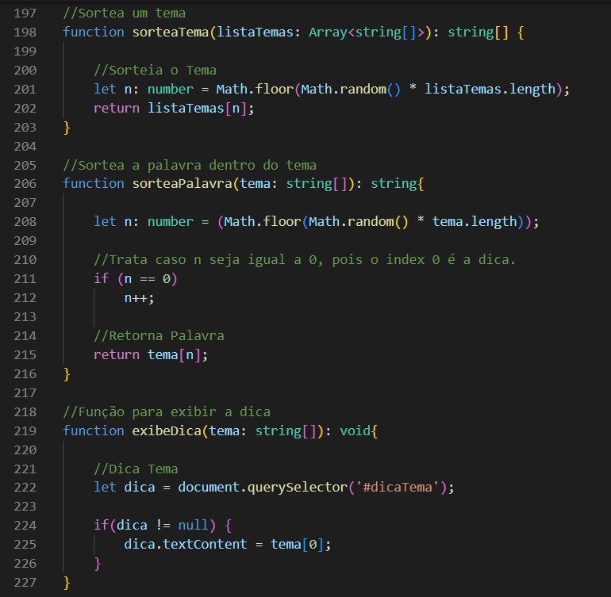
    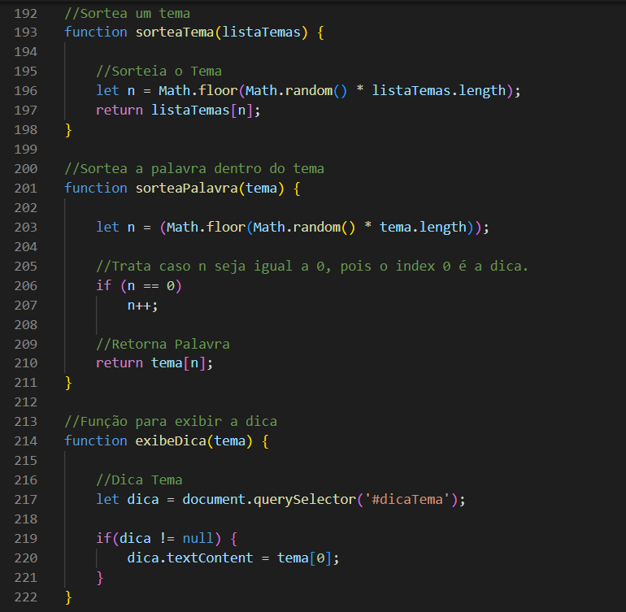

<h4>🔎Comparação</h4>

Como já mencionado anteriormente, a tipagem é uma das diferenças entre TypeScript e JavaScript. Ao analisar a implementação das funções propostas, é possível notar que a diferença entre as duas versões é insignificante. No entanto, uma vantagem do código em TypeScript é a sua legibilidade, pois a tipagem explícita dos parâmetros e variáveis pode ajudar a prevenir erros durante a criação e manutenção do código. Adicionalmente, o TypeScript oferece recursos avançados como interfaces e tipos, que podem aumentar a robustez e segurança da implementação. A utilização desses recursos pode contribuir significativamente para a criação de um código mais estruturado, coeso e escalável.

Outra vantagem do TypeScript é a integração com a IDE, que permite a verificação de tipos em tempo de compilação e a sugestão de métodos e propriedades para as variáveis, aumentando a produtividade do desenvolvedor.

 

A próxima função a ser criada tem como objetivo exibir os traços na tela, indicando o tamanho da palavra a ser descoberta. Para isso, usamoremos a propriedade <code>.length</code> para obter o tamanho da palavra e, em seguida, criamos um loop que adiciona um traço para cada letra da palavra. Esses traços são exibidos na tela por meio de uma lista não ordenada (tag "ul"), onde cada traço é um elemento "li".

 

    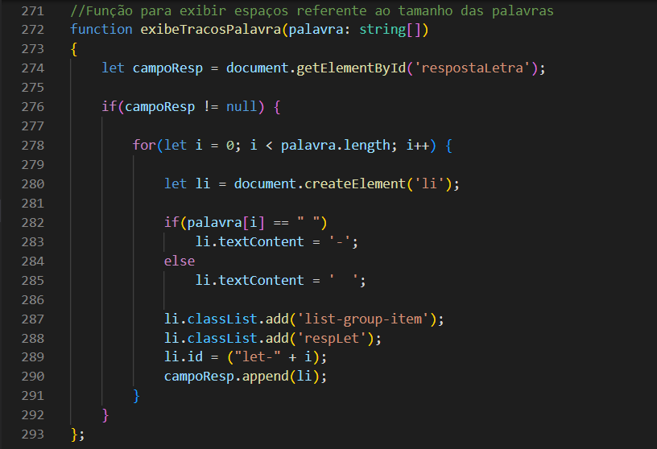
    

<h4>🔎Comparação</h4>

Como podemos ver nas imagens acima, as diferenças entre TypeScript e JavaScript são notáveis. TypeScript apresenta tipagem e verificação para garantir que o campo onde a palavra será exibida (id "respostaLetra") exista na página. Como já mencionado, o TypeScript obriga que esses tratamentos sejam realizados. Por outro lado, o JavaScript não possui tipagem nem verificação de erros, o que pode tornar o código menos legível e mais propenso a falhas.

 

Embora as demais funções necessárias para concluir o projeto estejam disponíveis no repositório, não serão apresentadas aqui para evitar um excesso de informações. No entanto, é importante destacar que essas funções são cruciais para o funcionamento adequado do jogo, pois incluem recursos como a captura de eventos do teclado, a validação da letra inserida pelo usuário e a atualização da tela com as informações corretas.

O código do repositório está bem comentado, logo seu entendimento será simples.

 

 
<h3>🎲 Conclusão / TypeScript vs JavaScript</h3>

O projeto demonstra algumas das diferenças significativas entre TypeScript e JavaScript. O TypeScript apresenta uma forte tipagem estática, que permite a identificação de erros de tipo em tempo de compilação, garantindo maior segurança e confiabilidade ao código. Além disso, o TypeScript possui recursos avançados de orientação a objetos (que não foram usados nesse projeto), como interfaces e classes, tornando-o mais adequado para projetos de grande porte e equipes de desenvolvimento maiores.

Por outro lado, o JavaScript é uma linguagem de script leve e versátil, que permite desenvolvimento rápido e fácil de aplicativos da web. É amplamente utilizado em projetos menores e para prototipagem rápida. No entanto, a falta de tipagem e verificação de erros pode tornar o código menos legível e mais propenso a erros.

Em resumo, o TypeScript oferece recursos adicionais de segurança e orientação a objetos, enquanto o JavaScript é mais ágil e flexível. A escolha entre uma ou outra depende das necessidades específicas do projeto e das preferências da equipe de desenvolvimento.

 
<h3>🎈Executar projeto</h3>

Para executar o projeto presente nesse repositório, acesse: https://gameforca.netlify.app/

